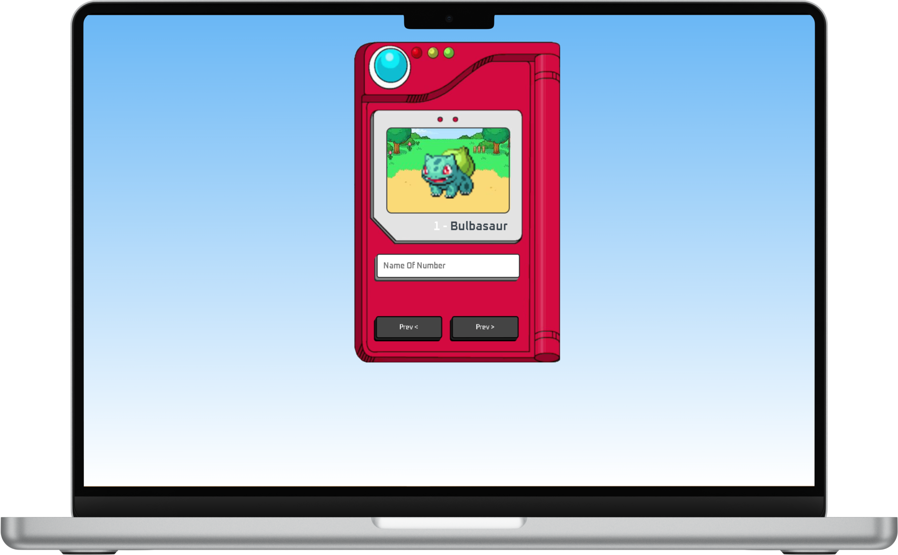

<h1 align="center">PokeDex</h1>

<h3 align="center">
  Ache seu pokemon favorito!
</h3>

## 🏠 About the project

Desenvolvi uma Pokédex simples utilizando JavaScript para consumir a PokéAPI. A aplicação permite pesquisar por Pokémon e exibir informações como nome, tipo, habilidades e sprite. Este projeto foi fundamental para consolidar meus conhecimentos em JavaScript e me introduziu ao mundo das APIs.
 

## 🖥️ Technologies

[JavaScript]  

## Run Project in you Navigator

https://pokedex-two-murex.vercel.app/

## Contributors

We thank the following people who contributed to this project:

<table>
  <tr>
    <td align="center">
      <a href="#">
         
        
          <b>Luan Rebuli</b>
        
      </a>
    </td>
  </tr>

## Certificates

</table>
